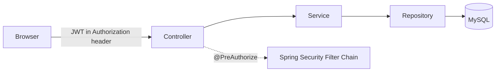

# Employee Management System

A full-stack HR/employee management platform with JWT authentication, role-based
access control, department and manager hierarchies, and an admin dashboard —
built on Spring Boot and React.

**Stack:** Java 17 · Spring Boot 3 · Spring Security · MySQL · React 18 · Vite · Docker

---

## Overview

This started as a basic employee CRUD app and was rebuilt into a role-aware
internal HR system: three account types (Admin, HR, Employee) with different
permissions, department/manager relationships, searchable and paginated
employee records, and an analytics dashboard — the kind of feature set an
actual internal HR tool needs, not just a database front-end.

## Features

**Auth & Access Control**
- JWT-based authentication (stateless, no server-side sessions)
- Role-based access control — Admin / HR / Employee, enforced with
  `@PreAuthorize` at the method level (not just URL pattern matching)
- Passwords hashed with BCrypt; no credentials ever stored in plain text

**Employee & Org Management**
- Full employee CRUD with server-side validation
- Department management
- Self-referential manager relationships (who reports to whom)
- Employees can view their own profile (`/api/emp/me`) without HR/Admin rights

**Data & Search**
- Server-side pagination, sorting, and search (name/email) with department
  filtering, built on JPA Specifications so filters compose instead of
  needing a repository method per combination

**Dashboard**
- Headcount by department, employees missing a department/manager, at-a-glance
  totals — computed with a single grouped JPQL query, not N+1 lookups

**API & DevOps**
- Centralized error handling — every failure (validation, not-found,
  duplicate, auth, unexpected) returns the same structured JSON shape
- Interactive API docs via Swagger / OpenAPI with JWT support built in
- Dockerized: multi-stage builds for both services, `docker-compose.yml`
  wiring MySQL + backend + frontend, nginx reverse-proxying API calls so
  the browser only ever talks to one origin
- Unit tests for business rules (Mockito) and an integration test suite that
  proves the RBAC matrix is enforced end-to-end through the real Spring
  Security filter chain

## Tech Stack

| Layer | Technology |
|---|---|
| Backend | Java 17, Spring Boot 3.2, Spring Data JPA, Spring Security |
| Auth | JWT (jjwt), BCrypt |
| Database | MySQL 8 (H2 for tests) |
| API Docs | springdoc-openapi / Swagger UI |
| Frontend | React 18, Vite, React Router, Axios |
| Testing | JUnit 5, Mockito, Spring Security Test |
| DevOps | Docker, docker-compose, nginx |

## Architecture



Standard layered architecture — **Controller → Service → Repository** — with
DTOs at the API boundary (entities never cross it directly), a mapper layer
for entity↔DTO conversion, and a `@RestControllerAdvice` global exception
handler for consistent error responses.

## Role-Based Access Control

| Action | Admin | HR | Employee |
|---|:---:|:---:|:---:|
| View own profile | ✅ | ✅ | ✅ |
| List / view all employees | ✅ | ✅ | ❌ |
| Create / update employee | ✅ | ✅ | ❌ |
| Delete employee | ✅ | ❌ | ❌ |
| Manage departments | ✅ | ✅ (no delete) | ❌ |
| Create login accounts | ✅ | ❌ | ❌ |

## Getting Started

Two ways to run this — full instructions in **[SETUP.md](./SETUP.md)**:

**Docker (fastest):**
```bash
cp .env.example .env   # fill in real values first
docker compose up --build
```
Frontend at `http://localhost:5173`, API docs at `http://localhost:5173/swagger-ui.html`.

**Manual (JDK 17 + Node 18 + MySQL required):** see SETUP.md sections 1-4.

## API Reference (selected endpoints)

| Method | Endpoint | Access |
|---|---|---|
| POST | `/api/auth/login` | Public |
| POST | `/api/auth/register` | Admin |
| GET | `/api/emp?search=&departmentId=&page=&size=` | Admin, HR |
| GET | `/api/emp/me` | Any authenticated user |
| POST / PUT / DELETE | `/api/emp/{id}` | Admin, HR (delete: Admin only) |
| GET / POST / PUT / DELETE | `/api/departments` | Varies — see table above |
| GET | `/api/dashboard/summary` | Admin, HR |

Full interactive reference (request/response schemas, try-it-out): Swagger UI
at `/swagger-ui.html` once the backend is running.

## Project Structure

```
ems-backend/ems-backend/src/main/java/com/employeesystem/emsbackend/
├── config/          SecurityConfig, OpenApiConfig, DataSeeder
├── controller/       REST endpoints
├── dto/              Request/response contracts
├── entity/           JPA entities
├── exception/        Global error handling
├── mapper/            Entity <-> DTO conversion
├── repository/        Spring Data JPA repositories
├── security/           JWT filter, entry points, user details
├── service/            Business logic
└── specification/       Dynamic query filters

ems-fullstack/src/
├── component/    Pages and UI components
├── context/       Auth state (Context + hook, split for Fast Refresh)
├── service/        API clients (axios)
└── style/           CSS
```

## Testing

```bash
cd ems-backend/ems-backend
./mvnw test
```
Runs against an in-memory H2 database — no MySQL or environment variables
needed. See SETUP.md for what's covered.

## Roadmap

Built so far: JWT auth, RBAC, department/manager hierarchy, pagination/search,
dashboard, Swagger docs, tests, Docker. Not yet done: GitHub Actions CI,
file/document upload, audit logging. Tracked as the natural next additions,
not missing-by-accident.

## Author

**Harish Kattamuri**
[LinkedIn](https://linkedin.com/in/kattamuri-harish-guptha-a01a34294) · [GitHub](https://github.com/Harish141201)
